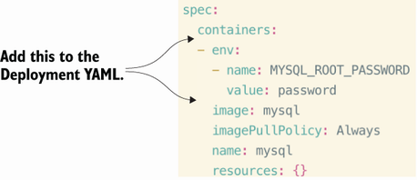

---
# Question 1
In cluster cluster_1, in a namespace called `mydb`, create a Deployment with the kubectl command line (imperatively) named `mysql`, with the image `mysql:8`. List the Pods in the `mydb` namespace to see if the Pod is running. If the Pod is not running, view the logs to determine why the Pod is not in a healthy state. Once you’ve collected the necessary log information, make changes to the Pod to fix it and get it back to a running, healthy state.
```
kubectl create ns mydb
kubectl config set-context --current --namespace mydb
kubectl config get-contexts 

kubectl create deploy mysql --image mysql:8
kubectl logs mysql-56787b9bcf-f7fdq

```
fix:


```
kubectl edit deploy mysql
```

# Question 2

```
kubectl apply -f log-pod.yml

kubectl logs busybox --all-containers
kubectl config set-context --current --namespace default
```