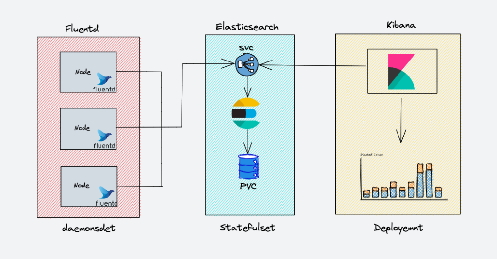

# kubernetes-efk
EFK Kubernetes manifests



# Labs
```
kubectl apply -f es-svc.yml # deploy the Elasticsearch stateful set

kubectl apply -f es-sts.yml  # deploy statefulset
kubectl port-forward es-cluster-0 9200:9200 # conduct test by forward the localhost port to pod's port

curl http://localhost:9200/_cluster/health/?pretty

kubectl apply -f kibana-deployment.svc
kubectl apply -f kibana-svc.yml # ensure that firewall rule allows inbound connections

<node-external-ip>:30000


```

# Other components of elastic stack

- Elastic Metrics
- APM
- Uptime